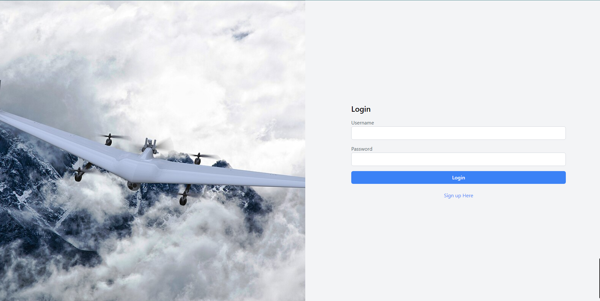
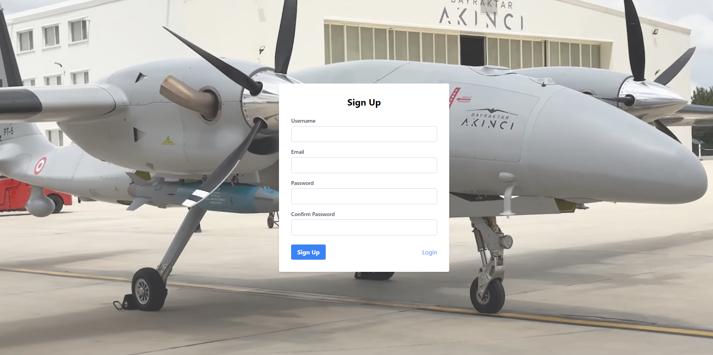
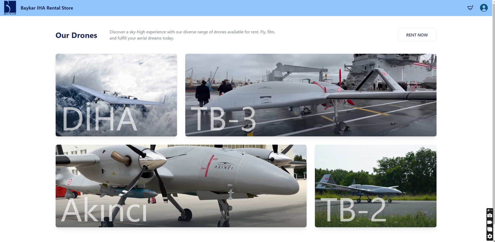
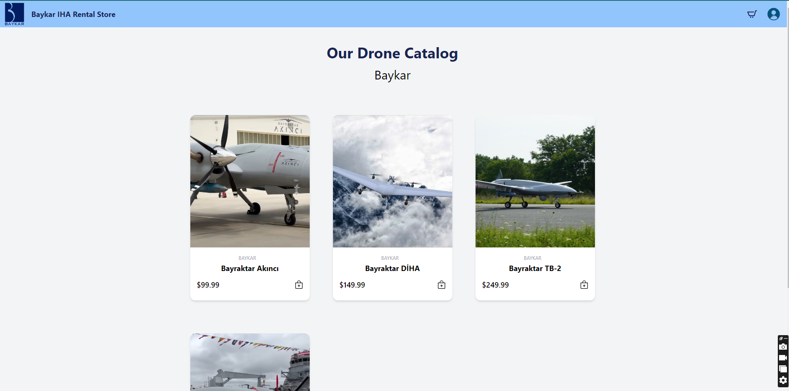
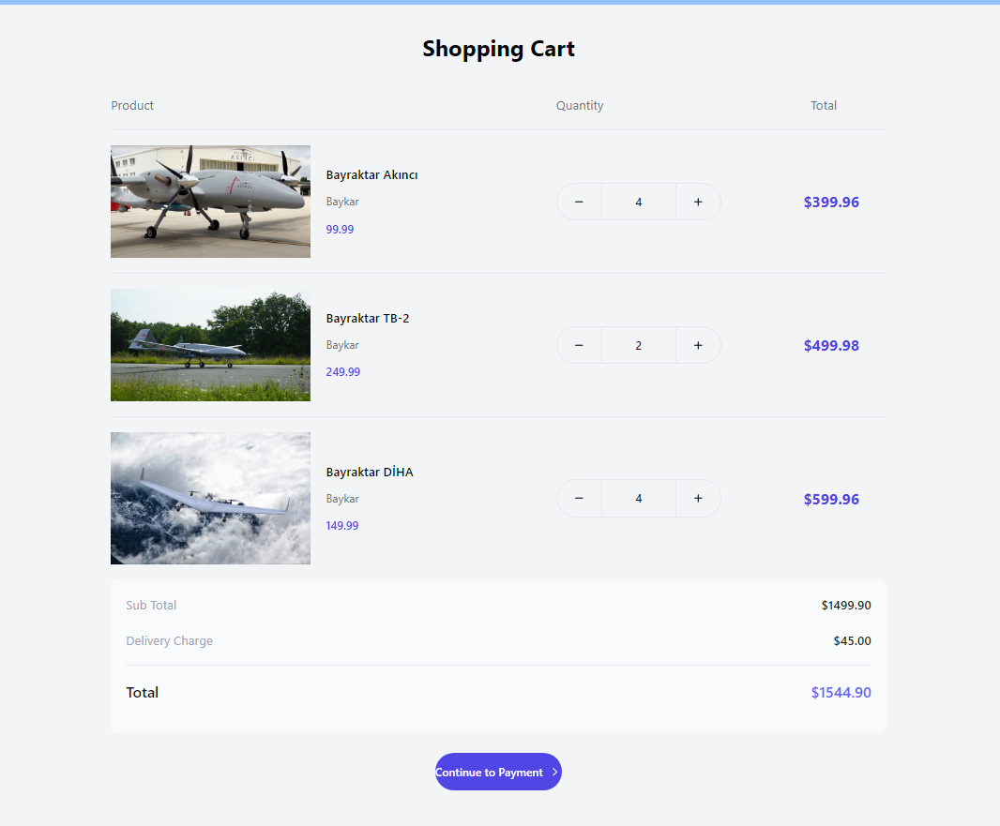
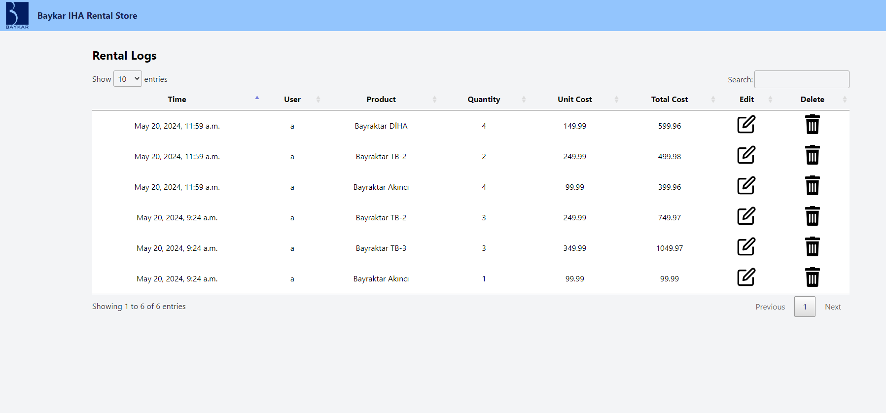
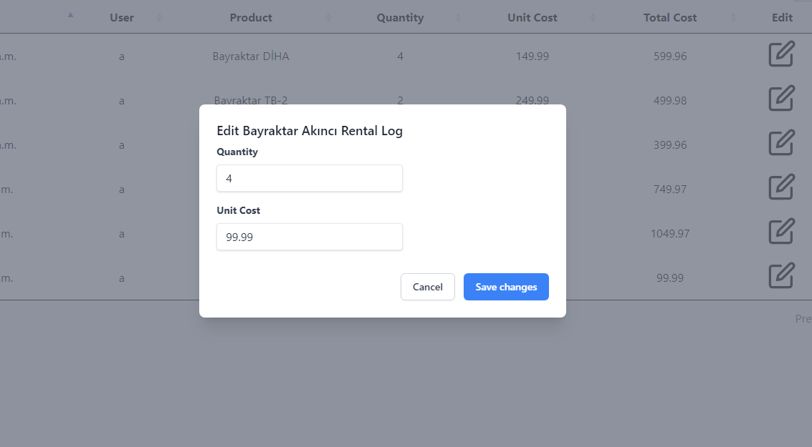

# Baykar Backend Mühendis Ön Değerlendirme Projesi

## Projeyi çalıştırma

      $ npm install
      $ npm run build:tailwind

## Kullanılan Teknolojiler

    - Django
    - Python
    - PostgreSQL
    - Tailwind CSS
    - DataTable
    - REST Framework

## Ekran Akışı

### 1. Giriş Ekranı

- Zaten hali hazırda hesabı olanlar için sisteme giriş yapabilecekleri sayfa.

### 2. Kayıt Ekranı

- Hesabınızın olmaması durumunda buradan kayıt oluşuturabilirsiniz.

### 3. Ana Sayfa

- Ana sayfamızda en popüler ürünlerimizi sergilediğimiz kartlardan olşuan animasyonlu bir alanımız vardır.
- Sağ yukarıda bulunan 'RENT NOW' butonu bizi ihların listelendiği mağaza sayfasına götürür.
- Yukarıdaki navigasyon çubuğunda ise sol taraftaki Baykar resmine basarak bu ana sayfaya dönmek mümkündür.
  Sağdaki butonlarda ise sırasıyla 'Sepet' ve 'Kullanıcı Paneli' dir. Kullanıcı panelinden çıkış yapmak ve
  daha önceki satın alımları görebileceğiniz sayfaya yönlendiren buntonlar bulunur.

### 4. Mağaza Sayfası

- Satılması mümkün olunan cihazların verileri database'den çekilip gereki assatler web server'da store ediliyor.
- Bu veriler ile oluşturulan kartların üzerine tıklanarak sepete eklemek mümkün.
- İstenilen cihazları aldıktan sonra sepete yönelilir.

### 5. Sepet Sayfası

- Alınan ürünler database'de kişiye özel olarak muhafaza edilir ve siz elinizle atmadıkça sepetinizden ürünler düşmez.
- Bu ekranda bulunan '-' ve '+' butonlarını kullanarak sepetinizdeki ürünlerin miktarını değiştirebilirsiniz.
- Ürünlerin birim fiyatını, miktarını, kalem başına toplam ücreti aynı satırda görebilirsiniz.
- Aşağıda ise teslimat ücreti ve ara toplam bulunur.
- Onların altında ise 'Son Toplam' yer alır.
- En altta kalan butonumuz satın alma işlemini bitirmek için basılır.
- Sistem septtekileri hesabınza satın alnımış olarak kayıt düşürüp sepetinizi boşaltır.

### 6. Log Sayfası

- Bu sayfada satın alma işlemlerinin geçmişini görüyoruz.
- Sağ üstteki filtreyi kullanarak kolonlar arasında filtreleme yapılır.
- Satır sonundaki silme butonuna basarak, o satırı satın alım geçmişinden silmek mümkündür.
- Sağ ikinci buton ise 'Edit' ya da düzenleme butonuna basarak gerekli satırı düzenlemek için dialog ekranı açılır.
  Şu anlık bu dialog ekranı tam çalışmıyor. Zamanın yetersiziliği yüzünden hatayı çözecek vakit bulamadım.
  
- Sol üstteki Baykar resimini tıklayarak ana sayfaya geri dönülür.

